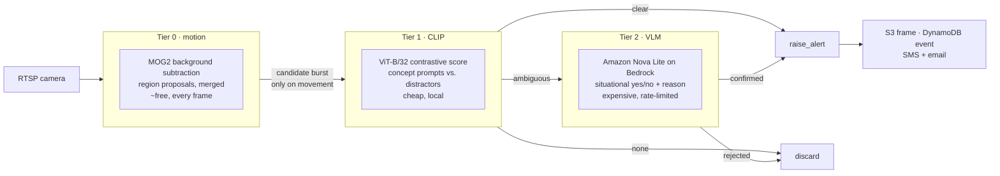

# harmsDetection

Real-time harm detection on CCTV streams — the detection worker behind
[SkyEye](https://www.skyeyeprotection.com/).

It reads an RTSP camera and raises an alert when it sees a person on the
ground, a fight, signs of a robbery, or a weapon. The engineering problem is
not "can a model recognise this" — it is doing it continuously, on many
cameras, without spending a fortune on inference or burying the user in false
alarms.

## The problem it solves

A camera produces roughly 2.6 million frames a day. Sending each one to a
vision-language model is both unaffordable and unnecessary: almost every frame
is an empty room. But the cheap detectors that can run on every frame cannot
tell a fight from a hug, or a fall from someone crouching.

So the system is built as a **cascade**, where each tier exists to keep frames
away from the tier behind it. Cost falls by orders of magnitude at every hop,
and the expensive judgment is spent only where cheap methods are genuinely
ambiguous.

## How it works



**Tier 0 — motion.** MOG2 background subtraction on a half-scale frame, contours
above a minimum area promoted to regions of interest, padded to squares, capped
at ten and merged by IoU. No movement, no candidate. This is what makes 24/7
operation affordable.

**Tier 1 — CLIP.** Each region is scored contrastively: the concept's prompts
against a set of deliberate distractors, so the score is a *margin*, not a raw
similarity. Prompts are descriptive rather than label-like (`"a person seen by a
security camera"`, not `"person"`) — measured at +0.083 margin and 100% recall
on real people. Distractors that collide with their own target are excluded
per-concept, and CLAHE contrast enhancement runs first. The outcome is one of
three: `clear` alerts immediately, `none` is dropped, `ambiguous` goes up.

**Tier 2 — VLM.** Amazon Nova Lite, via Bedrock, answers one concept-specific
question about the cropped frame and returns yes/no with a short reason.

Two rules keep the cascade honest:

- **Abstract events never resolve on CLIP alone.** A fall, a robbery or an
  assault is a *situation*, not an object, so those labels are always sent to
  the VLM regardless of score. Only concrete things — a person, a knife — can
  be closed cheaply, and only on a high margin.
- **Abstract events are gated on a person being present.** No person, no
  robbery, no fight, no fall — so no VLM call. If a camera does not monitor
  people at all, the gate opens rather than blinding a camera configured only
  for `robos`.

### Where the money is controlled

Three separate limits, each at a different point, because they do different
jobs:

| Limit | Default | Purpose |
|---|---|---|
| `HEIMDALL_VLM_MIN_INTERVAL` | 6s per (camera, label) | Caps spend *before* the VLM call |
| `HEIMDALL_ALERT_COOLDOWN` | 20s | Re-alerts while a threat persists |
| `HEIMDALL_NOTIFY_COOLDOWN` | 300s | SMS is the expensive channel |

The ordering matters and is the reason the first one exists: the alert cooldown
runs *after* the VLM has answered, so by the time it suppresses a duplicate the
money is already spent. Throttling has to happen on the way in.

## Key technical decisions

**One codebase, two topologies.** `transport.py` exposes `LocalQueue` and
`SqsQueue` behind an identical interface, so the same tier functions run as
three threads in one process or as three EC2 instances talking over SQS.
Nothing in `tiers.py` knows which it is.

**Frames travel by reference.** A JPEG exceeds the 256 KB SQS message limit, so
in distributed mode `pack_frame` writes the image to S3 and the message carries
only the key. Messages stay small and cheap; `cleanup_frame` deletes the object
once a tier is finished with it.

**Split by cost profile, not by layer.** In the distributed topology, a cheap
box runs tier 0 for *many* cameras 24/7, while a single larger box runs CLIP and
the VLM for *all* of them and is started on demand — then shuts itself down
after two idle hours. The expensive machine only exists while something is
moving.

**Bursts, not streams.** On movement, tier 0 emits a short burst of frames
rather than a continuous feed, so a judgment is made on several views of an
event instead of one unlucky frame — without re-opening the firehose.

**Queues have dead-letter queues.** `create_queues.py` creates each queue with a
DLQ after three failed receives, a 120s visibility timeout sized for CLIP/VLM
latency, and a one-hour retention because a stale security event is worthless.

**Prompts were tuned against real model output, and the reasoning is in the
code.** The VLM questions carry comments recording what failed: asking "is a
robbery happening" is unanswerable from a single frame, so it asks about visible
*indications*; "violence" confirmed on contact sports until the question
excluded them explicitly; falls are asked as "is someone on the ground",
because the aftermath is what a still frame can actually show.

## Running it

Requires Python 3.10+, an AWS account with Bedrock access, and an RTSP source.

```bash
python3 -m venv venv && source venv/bin/activate
pip install --upgrade pip
pip install --extra-index-url https://download.pytorch.org/whl/cpu -r requirements.txt
```

Describe the camera in `context.json`:

```json
{
  "instance_id": 1,
  "client_id": 1,
  "camera_name": "entrance",
  "detection_blacklist": ["caidas", "robos", "violencia", "persona"],
  "rtsp_secret_id": "heimdall/rtsp/<device-id>"
}
```

`detection_blacklist` is the list of concepts this camera watches for.
Credentials are not stored here: the worker resolves the RTSP URL from AWS
Secrets Manager by id, so the password never reaches disk or the instance's
user data. A literal `rtsp_path` is supported for local development only.

Run all three tiers in one process:

```bash
python cascade/run_pipeline.py local context.json
```

Or distribute them. Create the queues once, then start each box:

```bash
python cascade/create_queues.py       # prints the queue URLs

export HEIMDALL_CANDIDATE_QUEUE_URL=...   # tier 0 -> tier 1
export HEIMDALL_VLM_QUEUE_URL=...         # tier 1 -> tier 2

python cascade/run_pipeline.py motion-multi context.json   # cheap box, N cameras
python cascade/run_pipeline.py analysis    context.json    # shared CLIP + VLM box
```

Individual tiers (`tier0`, `tier1`, `tier2`) can also be run alone.

Instances are normally launched by
[HeimdalManager](https://github.com/BHS551/HeimdalManager), which passes the
context in through EC2 user data and enforces per-plan camera limits.

### Configuration

| Variable | Default | Meaning |
|---|---|---|
| `HEIMDALL_VLM_MODEL` | `us.amazon.nova-lite-v1:0` | Bedrock model for tier 2 |
| `HEIMDALL_VLM_MIN_INTERVAL` | `6` | Seconds between VLM calls per camera/label |
| `HEIMDALL_ALERT_COOLDOWN` | `20` | Seconds between repeat alerts |
| `HEIMDALL_NOTIFY_COOLDOWN` | `300` | Seconds between user notifications |
| `HEIMDALL_CANDIDATE_QUEUE_URL` | — | Tier 0 → tier 1 queue |
| `HEIMDALL_VLM_QUEUE_URL` | — | Tier 1 → tier 2 queue |

## Repository layout

```
cascade/            the current system
  run_pipeline.py     entry point; selects the topology
  tiers.py            the three tier loops
  vision.py           MOG2, region proposals, CLIP scoring, prompts
  vlm.py              Bedrock adjudication
  transport.py        LocalQueue / SqsQueue, S3 frame passing
  common.py           S3, DynamoDB, notifications, heartbeat, self-termination
  create_queues.py    idempotent SQS + DLQ setup
testbench/          mock RTSP camera for end-to-end tests
heimdall-eye.py     the original single-file worker the cascade was extracted from
rtsp_*.py           earlier detection experiments, kept for reference
```

`testbench/` runs a simulated RTSP camera serving real recordings from an EC2
instance, so the full production path can be exercised without a customer's
tunnel — including controlled failures (camera muted, tunnel refused) triggered
through a control file in S3.
